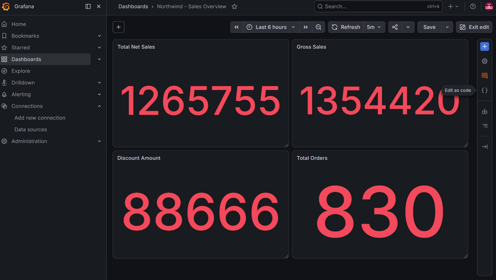
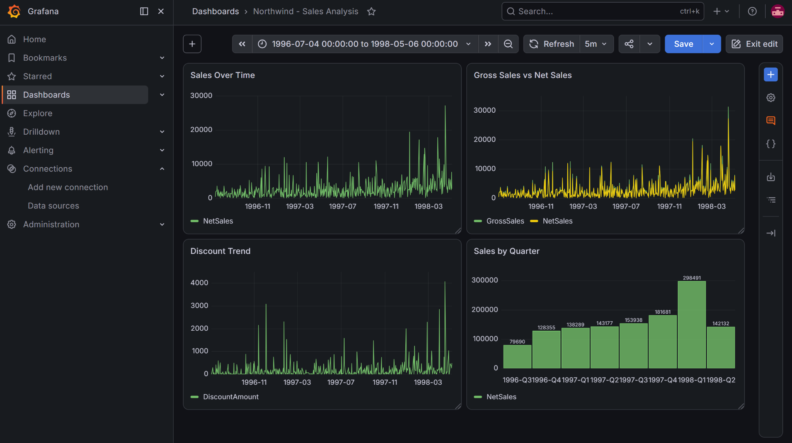
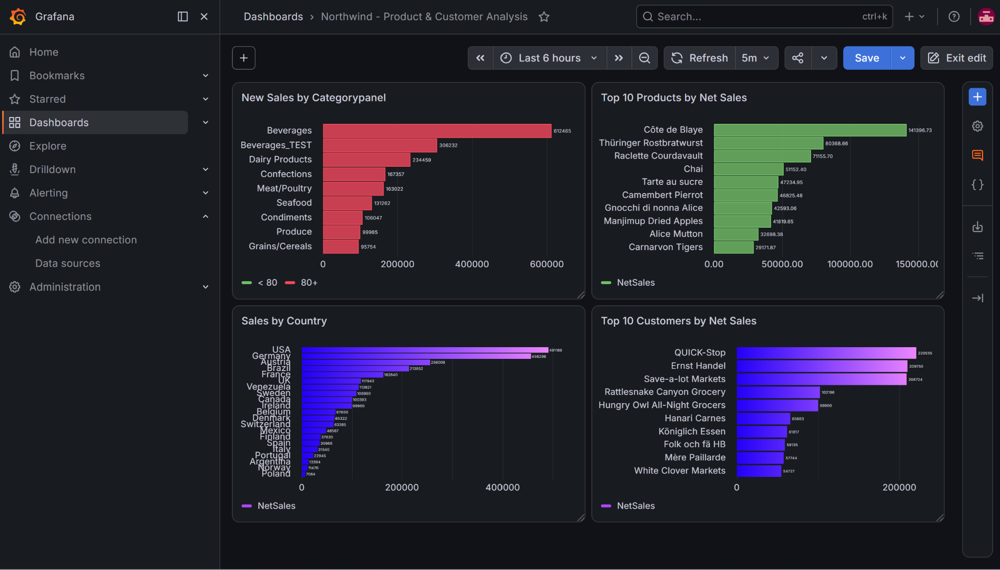
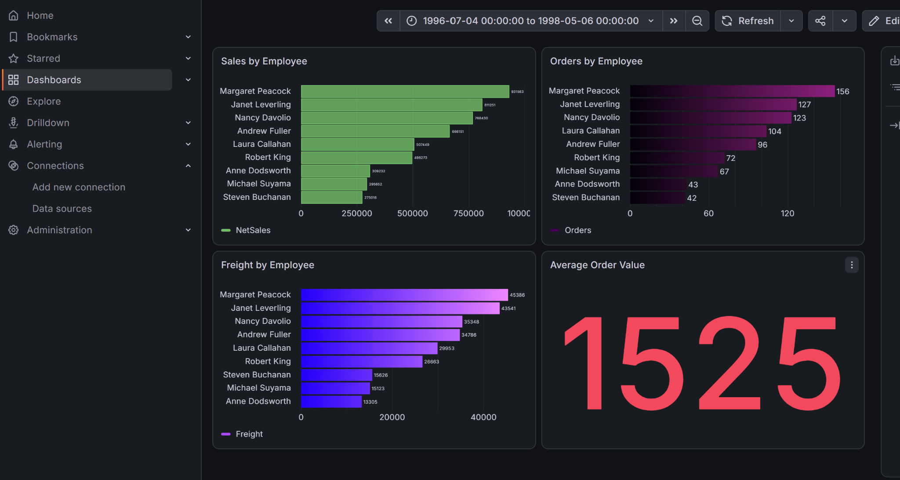

# مستند کامل پروژه Northwind ETL / Data Warehouse

**نسخه:** بازنویسی نهایی با تصاویر کامل چهار Dashboard Grafana

## 1. معرفی پروژه
این پروژه یک Pipeline کامل ETL/ELT برای Northwind است که با Docker، Apache Airflow، PostgreSQL، SQL Server، ClickHouse و Grafana پیاده‌سازی شده است. هدف، انتقال داده از SQL Server به PostgreSQL Staging، ساخت FactSales، انتقال Dimensionها به ClickHouse با SCD Type 2، اعمال CDC روی FactSales و ارائه تحلیل در Grafana است.

```text
SQL Server / Northwind
        │ Daily Full Load
        ▼
PostgreSQL / Staging
  ├── Dimensions
  └── FactSales
        │ PySpark / SCD2
        ▼
ClickHouse / Data Warehouse
  ├── Dimensions SCD2
  └── FactSales
        │
        ▼
Grafana / Analytics
```

مسیر CDC مستقل است:
`SQL Server CDC → CDC Raw → CDC Clean → CDC Apply → ClickHouse FactSales`

## 2. اجزای اصلی
| Component | وظیفه |
|---|---|
| SQL Server | Source Database و محل CDC |
| PostgreSQL | Staging و تولید FactSales |
| Apache Airflow | Orchestration و Scheduling |
| Celery / Redis | اجرای Taskهای Airflow |
| PySpark | ETL و SCD Type 2 |
| ClickHouse | Data Warehouse تحلیلی |
| Grafana | Visualization و Analytics |
| Docker Compose | اجرای سرویس‌ها |

## 3. PostgreSQL / Staging
Dimensionها: `DimGeography`, `DimCustomer`, `DimEmployee`, `DimProduct`, `DimDate`, `DimCategory`, `DimSupplier`

Fact: `FactSales`

Dimensionهای PostgreSQL به‌صورت Full Refresh از SQL Server بارگذاری می‌شوند.

## 4. DAGهای PostgreSQL
- `etl_dim_geography.py`: استخراج و Full Refresh جغرافیا.
- `etl_dim_customer.py`: Customer با Geography Lookup.
- `etl_dim_employee.py`: بارگذاری Employee.
- `etl_dim_category.py`: Full Refresh Category.
- `etl_dimsupplier_postgres.py`: بارگذاری Supplier.
- `etl_dim_product.py`: Product با Supplier و Category Lookup.
- `etl_dim_date.py`: ساخت DimDate و DateKey.

Dependencyهای اصلی:
```text
DimGeography → DimCustomer
DimCategory + DimSupplier → DimProduct
```

## 5. FactSales در PostgreSQL
`etl_fact_sales.py`، Orders و Order Details را با Dimensionها ترکیب می‌کند.

```text
GrossSales     = UnitPrice × Quantity
DiscountAmount = GrossSales × Discount
NetSales       = GrossSales - DiscountAmount
```

محاسبات مالی با Decimal و rounding مناسب انجام می‌شوند.

## 6. Dimensionهای ClickHouse و SCD Type 2
DAGها:
`etl_dimgeography_clickhouse.py`, `etl_dimcustomer_clickhouse.py`, `etl_dimcategory_clickhouse.py`, `etl_dimproduct_clickhouse.py`, `etl_dimsupplier_clickhouse.py`, `etl_dimdate_clickhouse.py`, `etl_dimemployee_clickhouse.py`

الگوی SCD2:
```text
Business Key
 ├─ Version 1 / IsCurrent=0 / EndDate=زمان تغییر
 └─ Version 2 / IsCurrent=1 / EndDate=NULL
```

Dimensionها با `ReplacingMergeTree(Version)` و DAGهای دارای `max_active_runs=1` اجرا می‌شوند.

## 7. FactSales در ClickHouse
`etl_factsales_clickhouse.py`، FactSales را از PostgreSQL منتقل، baseline را آماده و تعداد رکوردها و مقادیر مالی را Validation می‌کند.

## 8. SQL Server CDC
CDC برای `Orders` و `Order Details` فعال و تست شده است.

State اصلی:
`ETL_Settings.dbo.cdc_state`

ستون‌ها:
`TableName`, `CaptureInstance`, `LastProcessedLSN`, `LastProcessedAt`

## 9. DAGهای CDC
- `etl_cdc_fact_sales.py`: استخراج Changeهای Orders و Order Details و انتقال به Raw.
- `etl_cdc_clean.py`: پاکسازی و استانداردسازی Raw.
- `etl_cdc_apply_fact_sales.py`: اعمال Changeها در ClickHouse.

```text
INSERT → Insert new row
UPDATE → Close old version + Insert new version
DELETE → Tombstone
```

Checkpoint، LSN، SeqVal، Source و Idempotency برای کنترل پردازش استفاده می‌شوند. State نهایی در `CDC_FactSales_State` نگهداری می‌شود.

Schedule CDC: `*/30 * * * *`

## 10. Master DAG
`northwind_master_etl.py`

Schedule: `0 22 * * *` — هر روز ساعت 22:00.

Master دارای 17 Task است و ترتیب کلی آن:
```text
Cleanup FactSales
      ↓
PostgreSQL Dimensions
      ↓
PostgreSQL FactSales
      ↓
ClickHouse Dimensions
      ↓
ClickHouse FactSales
```

CDC در Master قرار ندارد و مستقل اجرا می‌شود.

## 11. Cleanup
`etl_cleanup_fact_sales.py` قبل از Full Load FactSales وضعیت قبلی را پاکسازی می‌کند تا baseline قبلی باعث duplicate نشود.

## 12. زمان‌بندی
| فرآیند | زمان‌بندی |
|---|---|
| Master ETL | هر روز 22:00 |
| FactSales CDC | هر 30 دقیقه |
| Grafana Auto Refresh | هر 5 دقیقه |

## 13. Grafana و چهار Dashboard

Grafana به ClickHouse و Database `northwind_dw` متصل است. هر چهار Dashboard با Auto Refresh پنج‌دقیقه‌ای تنظیم شده‌اند.

## 13.1 Northwind - Sales Overview
**پنل‌ها**
- **Total Net Sales:** مجموع NetSales.
- **Gross Sales:** فروش ناخالص.
- **Discount Amount:** مجموع تخفیف.
- **Total Orders:** تعداد سفارش‌های یکتا.

در Screenshot فعلی KPIها حدوداً Net Sales=1,265,755، Gross Sales=1,354,420، Discount Amount=88,666 و Total Orders=830 هستند.



## 13.2 Northwind - Sales Analysis
- **Sales Over Time:** روند NetSales در زمان؛ بازه Screenshot از 1996-07-04 تا 1998-05-06.
- **Gross Sales vs Net Sales:** مقایسه فروش ناخالص و خالص.
- **Discount Trend:** روند DiscountAmount.
- **Sales by Quarter:** مقایسه فروش خالص فصلی.

مقادیر قابل مشاهده Sales by Quarter:
| Quarter | Net Sales |
|---|---:|
| 1996-Q3 | 79,690 |
| 1996-Q4 | 128,355 |
| 1997-Q1 | 138,289 |
| 1997-Q2 | 143,177 |
| 1997-Q3 | 153,938 |
| 1997-Q4 | 181,681 |
| 1998-Q1 | 298,491 |
| 1998-Q2 | 142,132 |



## 13.3 Northwind - Product & Customer Analysis
- **Sales by Category:** فروش به تفکیک Category.
- **Top 10 Products by Net Sales:** ده محصول برتر.
- **Sales by Country:** فروش بر اساس کشور/جغرافیا.
- **Top 10 Customers by Net Sales:** ده مشتری برتر.

در Screenshot محصولاتی مانند Côte de Blaye، Thüringer Rostbratwurst و Raclette Courdavault در رتبه‌های بالاتر دیده می‌شوند و کشورهایی مانند USA و Germany سهم بالاتری دارند.

> عنوان پنل اول در Screenshot به شکل `New Sales by Categorypanel` دیده می‌شود؛ این یک مسئله نام‌گذاری عنوان پنل است و محتوای نمودار مربوط به Sales by Category است.



## 13.4 Northwind - Employee & Operations Analysis
- **Sales by Employee:** مقایسه NetSales کارکنان.
- **Orders by Employee:** تعداد سفارش هر Employee.
- **Freight by Employee:** Freight تخصیص‌یافته برای هر Employee.
- **Average Order Value:** میانگین ارزش سفارش.

در Screenshot فعلی Margaret Peacock با 156 سفارش، Janet Leverling با 127 و Nancy Davolio با 123 سفارش در رتبه‌های بالاتر هستند. مقدار Average Order Value برابر 1325 نمایش داده می‌شود.



## 14. Validation نهایی
Validation شامل تعداد رکوردهای FactSales، Orders، Products، GrossSales، DiscountAmount، NetSales، AllocatedFreight، Financial Consistency، CDC UPDATE، CDC DELETE، CDC Idempotency، CDC Tombstone و تطبیق PostgreSQL و ClickHouse بوده است.

| Metric | مقدار |
|---|---:|
| Current FactSales Rows | 2,154 |
| Orders | 830 |
| Products | 77 |
| GrossSales | 1,354,420.39 |
| DiscountAmount | 88,665.82 |
| NetSales | 1,265,754.57 |
| AllocatedFreight | 64,932.60 |
| Calculation Errors | 0 |

## 15. تست‌های CDC
- UPDATE در Order Details با موفقیت منتقل شد.
- UPDATE در Orders و تغییر Freight با موفقیت منتقل شد.
- DELETE در Order Details به‌صورت Tombstone مدیریت شد.
- Idempotency تست و تأیید شد.
- Versioning در Updateهای SCD2 تست شد.

## 16. Docker
سرویس‌های اصلی: `northwind-sqlserver`, `northwind-postgres`, `northwind-clickhouse`, `northwind-grafana`, `northwind-redis` و سرویس‌های Airflow.

Network: `northwind-network`

Airflow Worker با Python 3.10 و PySpark اجرا می‌شود.

## 17. Secret Management
Credentialها داخل DAGها Hardcode نشده‌اند.

Connections اصلی:
```text
northwind_postgres
northwind_sqlserver
clickhouse_northwind
```

`.env` محلی نباید commit شود و `.env.example` فقط placeholderهایی مانند `CHANGE_ME` دارد.

## 18. ساختار Repository
```text
northwind-etl/
├── .env.example
├── .gitignore
├── docker-compose.yml
├── instnwnd.sql
├── airflow/
│   ├── Dockerfile
│   ├── requirements.txt
│   ├── dags/
│   └── jars/
├── spark/
│   └── jars/
└── docs/
```

## 19. Git
Branch اصلی `main` است. Repository باید بدون Secret واقعی منتشر شود. `.env`، password واقعی و Fernet Key واقعی نباید در Git قرار گیرند.

## 20. معماری نهایی
```text
SQL Server Northwind
        │ Daily Full Load
        ▼
PostgreSQL Staging
        │ PySpark / SCD2
        ▼
ClickHouse DW
        │
        ▼
Grafana Analytics

CDC:
SQL Server CDC
 → CDC Raw
 → CDC Clean
 → CDC Apply
 → ClickHouse FactSales
```

## 21. وضعیت نهایی
- Docker architecture پیاده‌سازی شده است.
- Airflow با PostgreSQL Metadata DB اجرا می‌شود.
- Python 3.10 و PySpark آماده هستند.
- PostgreSQL Dimensions و FactSales Validation شده‌اند.
- ClickHouse Dimensions با SCD Type 2 پیاده‌سازی و تست شده‌اند.
- ClickHouse FactSales پیاده‌سازی شده است.
- CDC برای Orders و Order Details تست شده است.
- Master DAG با 17 Task موفق بوده است.
- چهار Dashboard Grafana ایجاد و با Refresh پنج‌دقیقه‌ای تنظیم شده‌اند.
- Secrets به Airflow Connections منتقل شده‌اند.
- مستندات آماده انتشار در Git هستند.

## 22. جمع‌بندی
معماری نهایی پروژه یک Data Engineering Pipeline کامل به شکل **Source → Staging → Warehouse → CDC → Analytics** است که Full Load شبانه، SCD Type 2، CDC سی‌دقیقه‌ای، ClickHouse و Grafana را در یک محیط Dockerized یکپارچه می‌کند.
